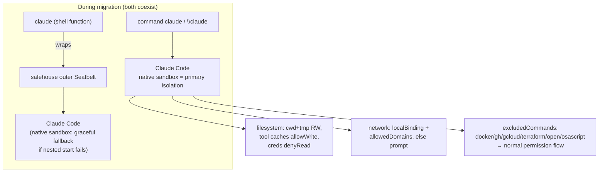

# feat: Enable Claude Code native Bash sandbox in settings.json.tmpl

## Summary

Enable Claude Code's built-in Bash sandbox (macOS Seatbelt / Linux bubblewrap) in `dot_claude/settings.json.tmpl`, replacing the current `"sandbox": { "enabled": false }` stub with a complete configuration. The configuration is modeled on the existing agent-safehouse policy (`dot_config/safehouse/config.tmpl`): local network access is permitted, a curated allowlist of development domains is pre-approved, credential files are protected from reads, and commands known to be incompatible with the sandbox are excluded.

This is the first step in a deliberate migration **away from** the external safehouse/cco Seatbelt wrapper **toward** Claude Code's native sandbox. The user intends to run `command claude` (raw, unwrapped Claude Code) going forward, so the native sandbox becomes the primary isolation boundary and there is no nested-Seatbelt conflict to design around. The `claude()` shell wrapper in `dot_config/zsh/sandbox.zsh` is intentionally left untouched in this change.

---

## Problem Frame

`dot_claude/settings.json.tmpl` currently ships `"sandbox": { "enabled": false }` — the native sandbox is declared but disabled, so every Bash command runs unsandboxed and isolation depends entirely on the external safehouse wrapper. The user wants to enable the native sandbox with a usable, security-conscious policy derived from the safehouse configuration, as the opening move in migrating off safehouse.

**Why now:** The native sandbox provides OS-level filesystem and network isolation that composes directly into Claude Code's permission flow (auto-allow of sandboxed Bash), removing the need for the external wrapper and its `--dangerously-skip-permissions` workaround.

---

## Scope Boundaries

**In scope:**
- Replace the `sandbox` block in `dot_claude/settings.json.tmpl` with a full configuration (enable, filesystem, network, excluded commands).
- Update the repository `CLAUDE.md` "Claude Code sandbox" section to document the native sandbox and the migration intent.

**Out of scope (Deferred to Follow-Up Work):**
- Removing or rewiring the `claude()` safehouse wrapper in `dot_config/zsh/sandbox.zsh`. The migration completes later; for now both can coexist (`command claude` uses the native sandbox; `claude` still wraps via safehouse).
- Decommissioning `dot_config/safehouse/config.tmpl` / `dot_config/cco/allow-paths.tmpl` and the `.chezmoiexternal.toml` cco entry.
- Pre-allowing Go / Rust / Python module-proxy domains (user opted to approve these via first-use prompts instead).

---

## Key Technical Decisions

### KTD1. Settings-file-only change; no wrapper modification
The user is migrating to the native sandbox and will use `command claude` (which bypasses the `claude()` function and therefore safehouse). Because the native sandbox runs without an outer Seatbelt sandbox in that path, there is **no nested `sandbox_apply` conflict** (the conflict noted in `dot_config/zsh/sandbox.zsh`'s codex comment only arises when an inner Seatbelt sandbox starts inside an outer one). Scope stays within `settings.json.tmpl`.

### KTD2. `failIfUnavailable: false` (graceful fallback)
Kept at the default `false` and set explicitly for self-documentation. If a plain `claude` invocation still routes through safehouse during the migration, or the sandbox cannot start, Claude Code warns and falls back to unsandboxed execution rather than hard-failing. This protects the migration period. (Contrast: managed/locked-down deployments use `true`.)

### KTD3. `allowUnsandboxedCommands` left at default `true`
The `dangerouslyDisableSandbox` escape hatch stays available so unexpected sandbox-incompatible commands can retry through the normal permission flow during migration, instead of failing hard. Revisit (set `false` for strict mode) once the policy has stabilized.

### KTD4. Network: `allowLocalBinding: true` + curated `allowedDomains`
Local/loopback access is granted via `allowLocalBinding` (covers localhost dev servers / 127.0.0.1 / ::1 binding) per the user's "local access OK" requirement. The pre-approved domain allowlist is scoped to the groups the user selected: GitHub, Node/npm/pnpm registries, Homebrew, and the Anthropic API. Wildcard subdomains (`*.githubusercontent.com`) are used where a service spans many hosts. Go/Rust/Python proxies are intentionally omitted — the sandbox prompts for those on first use and the user approves interactively.

### KTD5. Filesystem reads: protect credentials with `denyRead` + `allowRead` re-allow
The native sandbox's default read policy allows reading the entire disk, including `~/.ssh` and `~/.aws/credentials`. Per the user's choice ("protect SSH private keys too"), `denyRead` blocks `~/.ssh` and `~/.aws/credentials`, while `allowRead` re-permits the non-secret SSH files git needs (`~/.ssh/config`, `~/.ssh/known_hosts`). Git commit signing uses the 1Password SSH agent socket (not key files), and `git push` over SSH also relies on the agent — so blocking key-file reads does not break signing or push. The `denyRead`/`allowRead` precedence pattern is documented and supported by Claude Code.

### KTD6. Filesystem writes: pre-allow tool caches the default boundary would block
The default write boundary is the working directory plus the session temp dir. Subprocess builds write to shared caches outside that boundary (Go build cache, npm cache, Cargo registry, mise state). Because write denials are silent failures (no approval prompt, unlike network), these paths must be pre-declared in `allowWrite` or builds break. The set mirrors the read-write directories in `dot_config/safehouse/config.tmpl`, narrowed to caches the user's stack (Go, Node/pnpm, Rust, mise) actually writes.

### KTD7. `excludedCommands` for sandbox-incompatible tools
Per the user's selection and the official compatibility notes: `docker` / `docker compose` (incompatible with the sandbox), `gh` / `gcloud` / `terraform` (Go-based CLIs that fail TLS verification under macOS Seatbelt), and `open` / `osascript` (blocked Apple Events). These run outside the sandbox through the normal permission flow. `colima` was not selected and is omitted.

### KTD8. Path syntax uses `~/` prefix, not chezmoi template substitution
Sandbox filesystem paths resolve `~/` to the home directory natively, so `allowWrite`/`denyRead`/`allowRead` entries use literal `~/...` rather than `{{ .chezmoi.homeDir }}`. This keeps the block portable and avoids unnecessary template expansion. (The rest of the file continues to use `{{ .chezmoi.homeDir }}` where Claude Code does not expand `~`.)

---

## High-Level Technical Design

The two isolation layers during and after migration:



Resolved `sandbox` block shape (directional, not final formatting):

```jsonc
"sandbox": {
  "enabled": true,
  "failIfUnavailable": false,
  "excludedCommands": ["docker *", "docker compose *", "gh *", "gcloud *", "terraform *", "open *", "osascript *"],
  "filesystem": {
    "allowWrite": ["~/.cache", "~/go", "~/.npm", "~/.local/share/pnpm", "~/.cargo", "~/.rustup", "~/.local/share/mise"],
    "denyRead": ["~/.ssh", "~/.aws/credentials"],
    "allowRead": ["~/.ssh/config", "~/.ssh/known_hosts"]
  },
  "network": {
    "allowLocalBinding": true,
    "allowedDomains": ["github.com", "*.githubusercontent.com", "api.github.com", "codeload.github.com",
                       "registry.npmjs.org", "*.npmjs.org", "registry.yarnpkg.com",
                       "formulae.brew.sh", "*.brew.sh", "api.anthropic.com"]
  }
}
```

---

## Implementation Units

### U1. Replace the `sandbox` block in `settings.json.tmpl`

**Goal:** Swap the disabled stub for the full native-sandbox configuration defined in the Key Technical Decisions.

**Files:**
- `dot_claude/settings.json.tmpl` (modify — the `"sandbox"` block at the end of the JSON object)

**Approach:**
- Replace `"sandbox": { "enabled": false }` with the block sketched in High-Level Technical Design.
- Set `enabled: true`, `failIfUnavailable: false` (KTD2).
- `excludedCommands` per KTD7 — use the glob form (`docker *`) the docs specify; include a bare entry where the tool is invoked without args if needed (e.g. `docker compose *` is covered by `docker *`, so a single `docker *` may suffice — verify against how the user invokes them; the existing `permissions.allow` lists `docker compose:*`, `docker exec:*`, etc., so `docker *` covers all).
- `filesystem.allowWrite` / `denyRead` / `allowRead` per KTD5 and KTD6, using `~/` paths (KTD8).
- `network.allowLocalBinding: true` and `allowedDomains` per KTD4.
- Leave `allowUnsandboxedCommands` unset (default `true`, KTD3).
- Preserve valid JSON: the `sandbox` key is the last key in the object — ensure the preceding `"language": "japanese",` comma and closing braces remain correct after the edit.

**Patterns to follow:**
- Domain/path groupings and rationale mirror `dot_config/safehouse/config.tmpl` (read-write dirs → `allowWrite`; the credential-protection intent parallels safehouse's scoping).
- JSON style: alphabetized-ish arrays and 2-space indentation as used elsewhere in the file.

**Test scenarios:**
- Covers template validity: `chezmoi execute-template` on the file renders syntactically valid JSON (no trailing-comma / brace errors) — verify by piping rendered output to `jq .`.
- Rendered `sandbox.enabled` is `true` and `sandbox.network.allowedDomains` contains `github.com`, `registry.npmjs.org`, `api.anthropic.com`.
- Rendered `sandbox.filesystem.denyRead` contains `~/.ssh` and `~/.aws/credentials`; `allowRead` contains `~/.ssh/config`.
- Rendered `sandbox.excludedCommands` contains `docker *`, `gh *`, `open *`.
- `chezmoi apply --dry-run` shows only the intended diff to `~/.claude/settings.json` and no unrelated changes.

**Verification:** `make check-templates` passes; the rendered JSON parses with `jq`; `chezmoi apply --dry-run` diff is limited to the `sandbox` block.

---

### U2. Document the native sandbox in `CLAUDE.md`

**Goal:** Keep the repository's architecture docs accurate — record that the native Claude Code sandbox is now enabled and that it is the migration target away from safehouse.

**Files:**
- `CLAUDE.md` (modify — the "Claude Code sandbox" bullet under Key Patterns)

**Approach:**
- Append/extend the existing "Claude Code sandbox" paragraph to note that `dot_claude/settings.json.tmpl` now enables Claude Code's **native** Bash sandbox (Seatbelt on macOS), configured with local network access, a curated dev-domain allowlist, credential `denyRead`, tool-cache `allowWrite`, and `excludedCommands` for docker/gh/gcloud/terraform/open/osascript.
- State the migration posture explicitly: native sandbox is the intended primary isolation when running `command claude`; the safehouse wrapper remains for now and `failIfUnavailable: false` keeps behavior graceful if both layers are active.
- Keep it concise and in English (per the documentation-language rule for agent-facing docs).

**Patterns to follow:** Match the prose density and bullet style of the surrounding Key Patterns entries.

**Test scenarios:**
- `Test expectation: none -- documentation-only change.`
- `make scan-sensitive` passes (no PII introduced in the edited `.md`).

**Verification:** `make scan-sensitive` passes; the section accurately describes the shipped `settings.json.tmpl` sandbox block.

---

## Risks & Mitigations

- **Silent write failures break builds.** If a tool writes to a cache path not in `allowWrite`, the command fails with no prompt. *Mitigation:* KTD6 pre-declares the common caches; at first real use, watch for sandbox write errors and extend `allowWrite`. Documented as a known tuning point.
- **First-use network prompts for omitted domains.** Go/Rust/Python proxy domains will prompt on first use. *Mitigation:* intended behavior per KTD4; the user approves interactively, or these can be added later.
- **Nested Seatbelt if `claude` (wrapped) is used during migration.** Running the safehouse-wrapped `claude` with the inner sandbox enabled may fail to start the inner sandbox. *Mitigation:* `failIfUnavailable: false` (KTD2) degrades gracefully; the user's intended path is `command claude` (no outer sandbox).
- **`gh` excluded → runs outside sandbox.** `gh` (used heavily for PRs) bypasses isolation. *Mitigation:* accepted trade-off — it fails TLS under Seatbelt otherwise; it still goes through the normal permission flow.

---

## Verification (overall)

```sh
# Renders valid JSON
chezmoi execute-template < dot_claude/settings.json.tmpl | jq .   # (with test config/source as needed)
make check-templates       # template validity (CI parity)
make scan-sensitive        # no PII in edited .md files
chezmoi apply --dry-run    # preview: diff limited to sandbox block
make lint                  # full local check mirrors CI
```

Note: `settings.json.tmpl` is a `.tmpl` and excluded from JSON linters; `make check-templates` is the authoritative validity gate. Per CLAUDE.md, `chezmoi execute-template` in CI needs a test config with a `[data]` section and `--source` — use the established pattern if validating outside `make`.
