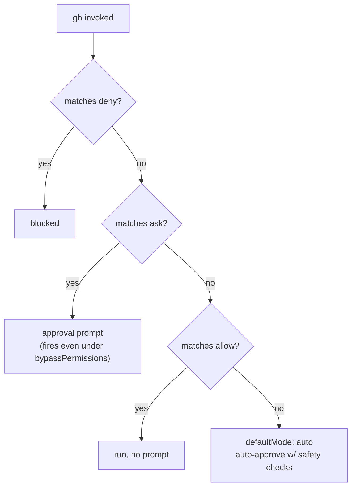

# feat: Gate gh mutating commands behind ask permission

## Summary

Add GitHub CLI (`gh`) state-changing subcommands to the `permissions.ask` list in
`dot_claude/settings.json.tmpl`, so they require explicit approval before running.
This mirrors the existing posture for state-changing git operations (commit / push /
history-altering) that are already `ask`-gated. Read-only `gh` commands stay in
`allow` (or unlisted under `defaultMode`); the currently-allowed `gh pr create`
moves from `allow` to `ask` because it mutates remote state.

---

## Problem Frame

The session default permission mode is `auto` (`permissions.defaultMode: "auto"`,
set in #207), which "auto-approves tool calls with background safety checks."
Concretely, any `gh` subcommand **not** explicitly listed runs without an approval
prompt. Today only three `gh` commands are explicitly listed — all in `allow`:
`gh pr create`, `gh pr reviews`, `gh pr view`. Every other `gh` command
(`gh pr merge`, `gh issue create`, `gh release create`, `gh repo delete`,
`gh workflow run`, `gh secret set`, …) is auto-approved.

`gh` commands run **outside** the sandbox (`sandbox.excludedCommands` includes
`gh *`), so a `gh` mutation reaches the real GitHub API with no sandbox boundary and,
today, no approval gate. The user wants the same governance already applied to git
writes: state-changing `gh` commands should require explicit approval.

`ask` has precedence over `allow` (deny > ask > allow) and fires **even under
`bypassPermissions`**, so listing a command in `ask` guarantees the prompt
regardless of session mode. This is the established mechanism used for
`git commit` / `git push` in the same file.

---

## Requirements

- **R1.** State-changing `gh` subcommands (create / edit / merge / close / delete /
  comment / run, etc.) resolve to `ask` after `chezmoi apply`, producing an approval
  prompt before execution.
- **R2.** `gh pr create` moves from `allow` to `ask` (it mutates remote state).
- **R3.** Read-only `gh` commands remain frictionless — `gh pr view` and
  `gh pr reviews` stay in `allow`; unlisted read-only `gh` commands stay governed by
  `defaultMode`.
- **R4.** The rendered settings file remains valid JSON and validates against the
  declared `$schema`.
- **R5.** No unrelated settings (env, hooks, plugins, sandbox, deny list) are altered.
- **R6.** The `ask` list keeps its existing alphabetical ordering; `gh …` entries
  sort before `git …` entries.

---

## Key Technical Decisions

- **Enumerate at the verb level, not the noun level.** `gh` groups read and write
  operations as sibling subcommands under the same noun (`gh pr view` is read,
  `gh pr create` is write). A noun-level wildcard like `Bash(gh pr:*)` would gate
  read-only `gh pr view` / `gh pr list` too, defeating R3. Each mutating verb must be
  listed explicitly: `Bash(gh pr create:*)`, `Bash(gh pr merge:*)`, etc.

- **`gh pr create` moves allow → ask.** It is a mutating command (creates a PR). Its
  current placement in `allow` predates this governance decision. Keeping it in
  `allow` while gating every other mutation would be inconsistent. Consequence: the
  LFG / `ce-commit-push-pr` flow will prompt on PR creation — acceptable and
  consistent, since that flow already prompts on the ask-gated `git commit` / `git push`.

- **`gh api` is not prefix-gatable and is left unlisted.** `gh api` reads on `GET`
  and mutates on `POST` / `PATCH` / `PUT` / `DELETE`; the mutating intent lives in a
  `--method`/`-X` flag or the endpoint, not a fixed command prefix, so no
  `Bash(gh api …:*)` pattern cleanly separates read from write. Attempting to gate it
  by prefix would either miss writes or block reads. Documented as a known gap rather
  than mis-gated. (See Open Questions for the future option of denying write methods.)

- **Scope the enumerated nouns to realistic workflow surfaces.** Cover `pr`, `issue`,
  `release`, `repo`, `workflow`, `run`, `secret`, `variable`, `label`, `cache`, `gist`.
  Rare / account-level mutations (`gh auth`, `gh ssh-key`, `gh gpg-key`, `gh ruleset`)
  are deferred — they are not part of the day-to-day repo workflow and can be added
  later if needed (see Deferred to Follow-Up Work).

- **Edit the template source directly.** `dot_claude/settings.json.tmpl` is a regular
  Go template chezmoi fully owns (not a `modify_` script, no OS guards), so a direct
  edit to the `ask` array is correct. Never edit the deployed `~/.claude/settings.json`.

---

## High-Level Technical Design

Permission resolution for a `gh` command under `defaultMode: auto` (deny > ask > allow):



Before: mutating `gh` commands fall through to the `auto` branch (no prompt).
After: mutating `gh` commands match the `ask` branch (prompt); read-only `gh pr view`
/ `gh pr reviews` still match `allow` (no prompt).

---

## Scope Boundaries

### In scope
- Adding mutating `gh` verbs to `permissions.ask`.
- Moving `gh pr create` from `allow` to `ask`.

### Non-goals
- Changing `defaultMode`, the sandbox config, or the deny list.
- Gating read-only `gh` commands.
- Restructuring how the LFG pipeline calls `gh`.

### Deferred to Follow-Up Work
- Account-level `gh` mutations (`gh auth`, `gh ssh-key`, `gh gpg-key`, `gh ruleset`).
- Denying `gh api` write methods (`gh api --method POST|PATCH|PUT|DELETE`) if a robust
  pattern proves reliable.

---

## Implementation Units

### U1. Add mutating gh commands to `ask` and move `gh pr create`

**Goal:** State-changing `gh` commands require approval; read-only `gh` stays frictionless.

**Requirements:** R1, R2, R3, R5, R6

**Dependencies:** none

**Files:**
- `dot_claude/settings.json.tmpl` (modify) — in the `permissions.ask` array
  (currently lines ~126–135), insert the `gh` mutating entries in alphabetical order
  (all sort before the existing `git …` entries). Remove `Bash(gh pr create:*)` from
  the `permissions.allow` array (currently line 27). Leave `Bash(gh pr reviews:*)` and
  `Bash(gh pr view:*)` in `allow`.

**Approach:** Two coordinated edits to one file:
1. Delete the `"Bash(gh pr create:*)",` line from `allow`.
2. Prepend the mutating `gh` entries to the `ask` array (before `Bash(git cherry-pick:*)`),
   keeping alphabetical order. Proposed entries:

   ```
   Bash(gh cache delete:*)
   Bash(gh gist create:*)
   Bash(gh gist delete:*)
   Bash(gh gist edit:*)
   Bash(gh issue close:*)
   Bash(gh issue comment:*)
   Bash(gh issue create:*)
   Bash(gh issue delete:*)
   Bash(gh issue edit:*)
   Bash(gh issue reopen:*)
   Bash(gh issue transfer:*)
   Bash(gh label create:*)
   Bash(gh label delete:*)
   Bash(gh label edit:*)
   Bash(gh pr close:*)
   Bash(gh pr comment:*)
   Bash(gh pr create:*)
   Bash(gh pr edit:*)
   Bash(gh pr merge:*)
   Bash(gh pr ready:*)
   Bash(gh pr reopen:*)
   Bash(gh pr review:*)
   Bash(gh release create:*)
   Bash(gh release delete:*)
   Bash(gh release edit:*)
   Bash(gh release upload:*)
   Bash(gh repo archive:*)
   Bash(gh repo create:*)
   Bash(gh repo delete:*)
   Bash(gh repo edit:*)
   Bash(gh repo fork:*)
   Bash(gh repo rename:*)
   Bash(gh repo sync:*)
   Bash(gh run cancel:*)
   Bash(gh run delete:*)
   Bash(gh run rerun:*)
   Bash(gh secret delete:*)
   Bash(gh secret set:*)
   Bash(gh variable delete:*)
   Bash(gh variable set:*)
   Bash(gh workflow disable:*)
   Bash(gh workflow enable:*)
   Bash(gh workflow run:*)
   ```

   (Directional list — the implementer confirms the final set against `gh` subcommand
   help and the repo's actual workflows; the verb-level enumeration rule from KTDs is
   the invariant, not this exact roster.)

**Patterns to follow:** The existing `ask` array style and the deny/allow entry style
in the same file (`Bash(<cmd>:*)`, one per line, trailing comma except the last). The
inline comment above the `ask` array documents the deny > ask > allow rationale —
consider extending it to note the gh read/write split.

**Test scenarios:**
- Covers R4. After editing, the template renders to valid JSON: run
  `make check-templates` (chezmoi `execute-template` with the test config) and confirm
  no parse error.
- Covers R4. `chezmoi apply --dry-run` (or `chezmoi diff`) shows only the intended
  `ask`/`allow` changes and the rendered `~/.claude/settings.json` is valid JSON.
- Covers R6. The `ask` array is alphabetically ordered with `gh …` entries preceding
  `git …` entries.
- Covers R2/R3. `gh pr create` appears exactly once (in `ask`, not `allow`);
  `gh pr view` and `gh pr reviews` remain in `allow`.
- Covers R5. `git diff` of the file shows changes confined to the `allow` and `ask`
  arrays — env, hooks, plugins, sandbox, and deny blocks untouched.

**Verification:** `make check-templates` passes; `chezmoi diff` shows the expected
JSON delta and nothing else; a manual read of the rendered `ask` list confirms the new
entries and the alphabetical ordering.

---

## System-Wide Impact

- **LFG / `ce-commit-push-pr` and other automated flows** will now prompt on
  `gh pr create` (and any other newly-gated `gh` mutation they invoke). This is
  intended and consistent with the already-gated `git commit` / `git push`. Fully
  unattended runs will block on these prompts — the same accepted trade-off documented
  for git writes in the file's inline comment.
- **Interactive sessions** gain an approval checkpoint before outward-facing GitHub
  mutations (PR merges, issue/release creation, secret changes), reducing the risk of
  an accidental auto-approved remote state change.

---

## Open Questions

- **`gh api` write gating (deferred).** Should write methods be denied or asked via a
  pattern like `Bash(gh api --method POST:*)`? Deferred until a pattern is confirmed
  reliable against Claude Code's matcher; today `gh api` stays unlisted.
- **Comment extension (minor).** Whether to extend the inline `ask` comment to
  document the gh read/write split, or keep the comment git-focused. Implementer's call.

---

## Sources & Research

- `dot_claude/settings.json.tmpl` — current `allow` / `deny` / `ask` lists and the
  inline deny > ask > allow rationale comment.
- `docs/plans/2026-06-19-001-feat-claude-default-auto-mode-plan.md` — confirms
  `defaultMode: auto` "auto-approves tool calls with background safety checks", i.e.
  unlisted `gh` mutations run without a prompt today.
- `docs/plans/2026-07-09-001-fix-sandbox-1password-socket-and-git-approval-plan.md` and
  #217 — established the git-write `ask`-gating pattern this plan mirrors.
- `CLAUDE.md` (native Bash sandbox section) — documents `gh *` in
  `sandbox.excludedCommands` (gh runs outside the sandbox) and the deny > ask > allow /
  ask-fires-under-bypassPermissions governance model.
